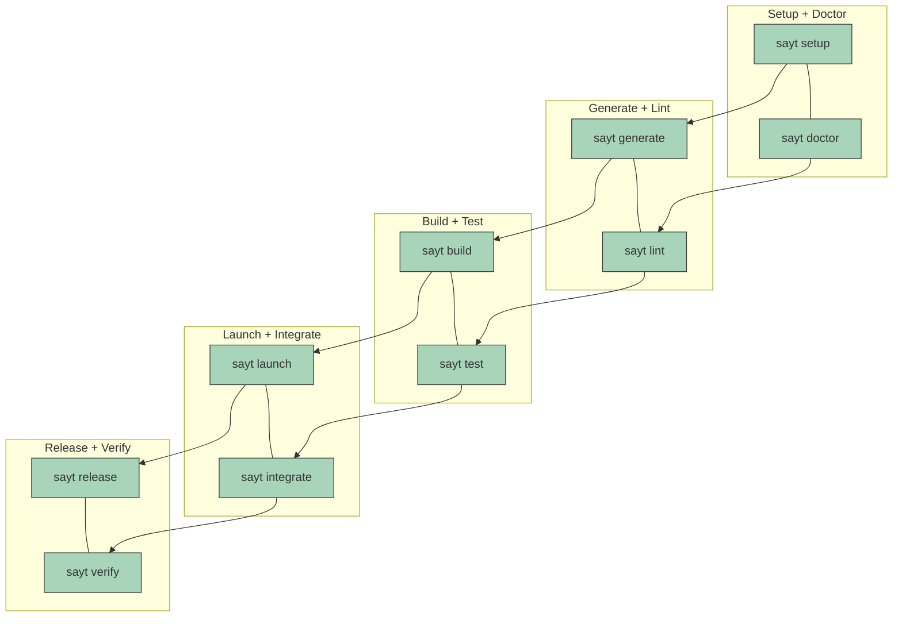

# SAYT CLI

Make your repo feel like it has its own DevOps team. SAYT wraps modern tooling
into a single command so you can bootstrap, build, test, and launch
with zero guesswork.

## Why SAYT?

- **Batteries included**: `setup`, `doctor`, `generate`, `lint`, `build`,
`test`, `launch`, `integrate`, `release`, and `verify` all live behind a single
entrypoint.
- **Zero drift**: Tasks re-use configuration you already use, from your vscode
setup to your docker compose files.
- **Portable**: Works anywhere nushell, docker and mise are available - macOS,
Linux, Windows (native or WSL), dev containers, CI runners.
- **Developer-first**: Every command prints the exact shell steps it executes,
making it easy to reproduce or customize workflows.

## Getting started

```bash
# Trust and install tools declared in .mise.toml, then warm up auxiliary caches
./plugins/sayt/sayt.nu setup

# Run health checks for required CLIs and network access
./plugins/sayt/sayt.nu doctor

# Build & test using your .vscode/tasks.json definitions
./plugins/sayt/sayt.nu build
./plugins/sayt/sayt.nu test

# Regenerate artifacts (Dockerfiles, manifests, configs) from .say.* rules
./plugins/sayt/sayt.nu generate --force

# Launch the docker-based dev stack or run full integration tests
./plugins/sayt/sayt.nu launch
./plugins/sayt/sayt.nu integrate
```

Use `./plugins/sayt/sayt.nu help <command>` for command-specific options.

## Command overview

| Command | What it does |
| ------- | ------------- |
| `setup` | Installs toolchains via `mise`, preloads VS Code task runner, delegates to project `.sayt.nu`. |
| `doctor` | Verifies key binaries and checks DNS connectivity to GitHub/Google. |
| `generate` / `lint` | Run declarative SAY rules across `.say.{cue,yaml,yml,json,toml,nu}` to keep scaffolding in sync. |
| `build` / `test` / `release` / `verify` | Execute named VS Code tasks through `uvx vscode-task-runner`, so CLI + editor stay in lockstep. |
| `launch` / `integrate` | Bring up Docker Compose stacks with Docker-out-of-Docker support (socat proxy, creds, kubeconfig). |

## Workflow at a glance



## Configuration magic

- Drop rules in `.say.cue`, `.say.yaml`, `.say.nu`, etc. `generate` and `lint` will merge them and
  run only the relevant steps for the files you requested.
- Want to hook into custom logic? Add a `.sayt.nu` at your repo root—`setup` automatically recurses
  into it.

## Bring-your-own stack

- VS Code tasks: build/test/release share the same definitions you already run
in the editor.
- Docker Compose: `launch` and `integrate` use your existing `compose.yaml`
targets while handling docker-out-of-docker plumbing, auth, and kubeconfig
exports automatically.
- Declarative configs: From CUE to YAML to Nu scripts, SAYT doesn’t enforce a
single format—use whichever `.say.*` file types suit your project.

## Requirements

- nushell v0.109+ (macOS/Linux/Windows)
- mise
- docker (or podman with socket compatibility)

That’s it. Clone the repo, run `./plugins/sayt/sayt.nu doctor`, and ship with confidence.
